# EKG.gg getting started

This repository is documentation and a help center for all folks that want to
get started writing widgets for the [EKG.gg][ekg] platform. This README.md will
cover the high level details, but feel free to read the [docs](./docs) and
[examples](./examples) for more in-depth information.

## Overall Widget Architecture

EKG.gg uses a familiar but modern architecture for our widgets.

**Already done some web dev?**

Widgets are comprised of three parts: JS, HTML templating, and CSS styling.

**New to web development?**

Widgets are comprised of three parts: functionality, markup, and styling. 

* **Functionality**: Given the previous state and new input, what should the
  widget's next state be?
* **Markup**: Given a state, what should the widget's structure be?
* **Styling**: Given a structure, how should it be presented to users?

> [!NOTE]
> If this sounds obvious / familiar that is because EKG.gg widgets are very
> much modeled after the architecture of the web and use standard web
> technologies. 

Let's now dive further into these three parts to see how they work in concert
with one another. We'll start with the most complicated part, functionality.

## Functionality - How state changes

**Language: ECMAScript**

Widgets are often not very useful unless they have the ability to change over
time and react to outside information. The way EKG.gg enables developers to
safely get access to this information and change over time is via our state +
event system. Widget functionality expected to be written in [ECMAScript][ecma]
(aka Javascript). Let's take a look at a simple example below:

```js
// widget.js
EKG.registerWidget({
  name: "Counter",
  initialState: (_ctx) => ({ count: 0 }),
  handleEvent(event, state, ctx) {
    switch (event.type) {
      case "ekg.chat.sent":
        return { ...state, count: state.count + 1 };
      default:
        return state;
    }
  }
});
```

This is a simple widget that just counts up whenever a new chat message is
sent. This state will later be sent to the markup renderer to be rendered which
we'll cover later in this document. Let's quickly breakdown this script:

**`EKG.registerWidget`** - EKG is variable in the global namespace that your
widget has access to. The EKG global provides a few helpers, but the most
important one is the `registerWidget` function. Every widget with functionality
is expected to call this function once which registers your widget into the EKG
event bus. If you do not call this function your widget will never receive
events. 

> [!WARNING]
> Make sure you only call `registerWidget` _once_. Calling it multiple times in
> your widget's script will cause an error.

**`name`**: The name property is used for debugging purposes. This name will be
used in logs and error reporting in the browser.

**`initialState`**: This is a function that takes a `ctx` object and returns
the first state of your widget. This initial state will be used for the first
render of the widget and for the subsequent `handleEvent` function call.

**`handleEvent`**: This is the most important part of any widget. This function
will be invoked any time something happens in the outside world that EKG.gg
currently tracks. This could be when a chat is sent, a monetary tip is given to
the streamer, or even something as neat as something being bought from the
streamer's Shopify store. `handleEvent` is a "pure" function that follows the
pattern of `state + event = newState`. This pattern keeps the logic of your
widget very simple, makes the `handleEvent` function _extremely_ easy to test,
and enables very neat tricks like "time-travel debugging".

**`ctx`**: This is a object where one can get context about the current widget
and runtime. Read more about it [here][ctx].

> [!WARNING]
> `handleEvent` expects a _new_ state to be returned from the handler if the
> state has changed and the widget needs to be rendered again. Meaning if you
> write something like `state.events.push(newEvent)` and return that state,
> EKG.gg will _not_ be able to tell that you have updated your state and a
> rerender will _not_ happen. Instead you should write something like 
> `return { ...state, events: state.events.push(newEvent) }` if you would like
> to trigger a rerender. 

> [!TIP]
> If the return value of `handleEvent` is a [falsy value][falsy], then the old
> state will be retained and a rerender of the widget will _not_ be
> scheduled. Additionally a rerender will be skipped if the same (by reference)
> state value is returned.

> [!NOTE]
> The keen eyed observers may have seen we said that the language required is
> ECMAScript not _Javascript_. That was not because we're trying avoid getting
> sued by Oracle. As you'll see in the security section below, our widgets
> actually run in VM called QuickJS. Many Javascript APIs and globals you may
> expect in a normal browser environment aren't actually available. Instead
> your widget should only use core ECMAScript APIs.

### Further reading

* [List of EKG events](./docs/scripting/list-of-events.md)
* [`handleEvent` best practices](./docs/scripting/best-practicies.md)
* [Using the ctx object][ctx]
* [Dealing with time](./docs/scripting/dealing-with-time.md)
* [Using Typescript](./docs/scripting/using-typescript.md)
* [Understanding the VM](./docs/scripting/understanding-the-vm.md)

## Markup - How state is rendered

**Language: HTML + Handlebars**

Once you have some state, you'll probably want to render it to something that
can be shown on screen. To do that EKG.gg expects a [Handlebars][handlebars]
template that renders HTML to be provided. Let's take a look at one now!

```hbs
<div class="main">
  <div class="num">{{count}}</div>
  <div class="subtext">Chats have been sent</div>
</div>
```

Continuing with our chat counter from above this is an extremely simple
template that will show an incrementing integer every time a new chat is sent.
With handlebars anything between `{{` and `}}` is considered a dynamic value
and will attempt to read that expression from the state object. Additionally
EKG.gg provides a series a view/block helpers to the Handlebars execution
context to make writing more complex renderings easier. Let's take a look at a
more complicated example that uses some of these view helpers to build a live
chat renderer.

```hbs
{{! An inline partial that can be later used }}
{{#*inline "renderMessage"}}
  {{! Inside this partial all expressions are now scoped to the current message }}
  <div id="{{id}}" class="message-container">
    <div class="username">{{username}}</div>
    <div class="badge">
      {{! Provided block helper for repeating a block X times }}
      {{#repeat subTier}}❤️{{/repeat}}
      {{! Provided block helper rending a block only if something equals something else }}
      {{#eq role "broadcaster"}}💻{{/eq}}
    </div>
    <div class="message">
      {{! Provided partial for rendering chat message objects }}
      {{> renderChat message }}
    </div>
  </div>
{{/inline}}

<div class="main-container">
  {{! Our state has a messages property which is an array of objects }}
  {{#each messages}}
    {{! Call the `renderMessage` partial for each message in the array }}
    {{! Inside this each block, `this` now refers to each object in the array }}
    {{> renderMessage this}}
  {{/each}}
</div>
```

With this technique you can see you can build sophisticated, powerful, but very
maintainable UIs with very little code.

> [!WARNING]
> While EKG.gg mostly uses a vanilla version of Handlebars, we _have_ removed
> the functionality to disable HTML escaping using the `{{{}}}` expression.
> Please do not attempt to construct HTML as a string, attach it to the state,
> then try and use the `{{{}}}` expression in Handlebars. You will get an
> error. Instead please rely on our view helpers that are linked below.

### Further reading

* [Handlebars docs][handlebars]
* [EKG.gg markup best practices](./docs/templating/best-practicices.md)
* [List of EKG.gg view helpers](./docs/templating/list-of-helpers.md)

## Styling - How the markup looks to users

**Language: CSS**

EKG.gg gives you nearly the full power of modern CSS to style your widgets.
Let's take a look at a simple example.

```css
/* styles.css */
/* Able to style :root pseudo-class */
:root {
  /* CSS custom properties */
  --primary-color: oklab(40.1% 0.1143 0.045);
  /* oklab() color space */
  --primary-bg: oklab(from var(--primary-color) calc(l - 0.15) a b);
}

/* Whatever CSS resets you like */
*,
*::before,
*::after {
  box-sizing: border-box;
}
* {
  min-width: 0;
  min-height: 0;
}

.main {
  max-width: 500px;
  margin: 0 auto;
  display: flex;
  flex-direction: col;
  background-color: var(--primary-bg);
  color: var(--primary-color);

  /* CSS Nesting */
  .num {
    font-size: 2em;
    font-style: bold;
  }

  .subtext {
    font-size: 0.8em;
    /* color-mix() */
    color: color-mix(in oklab, var(--primary-color), black 30%)
  }
}
```

> [!WARNING]
> Most likely the final browser that will be rendering your widget will be OBS.
> Most of the time widgets are added to a scene that will then be added as a
> browser source of OBS. While OBS uses [Chromium][chromium] underneath the
> hood, they currently use a [pretty old version of Chromium][obsversion].
> While EKG.gg does not limit what CSS you use, please ensure the CSS you end
> up writing does not use any features after Chrome 127. If you do they will
> most likely not work when your users go to use your widget in OBS. Feel free
> to use a site like [CanIUse][caniuse] to check what is supported where.

### Further Reading

* [Enter and exiting animations](./docs/styling/enter-and-exit-animations.md)
* [Learn about OKLCH colors][oklch]

## Settings - Allowing your users to customize things

Often times your users will want the ability to tweak your Widget in some way.
Maybe they want to change some colors around? Maybe they want to customize how
long an alert appears on screen until it fades? Maybe they want to change the
thank you message donos over a certain size get? In any and all of these cases
you don't want your users to modify the source code of your widget to make
these changes for themselves. _You_ as the widget creator should be able to
choose how and what users are able to customize. That's where EKG.gg settings
come in. 

When you create or update your widget you can optionally add a list of settings
and their schemas. This list will be given to EKG.gg as JSON. Let's look at
some example settings.

```json
{
  "settings": {
    "hideAfter": {
      "type": "boolean",
      "description": "Hide messages after time",
      "default": false
    },
    "hideAfterAmount": {
      "type": "integer",
      "description": "Hide messages after x seconds:",
      "default": 30,
      "min": 0
    },
    "messageLimit": {
      "type": "integer",
      "description": "Limit message amount",
      "default": 50
    },
    "alignment": {
      "type": "string",
      "description": "Align Messages:",
      "default": "column",
      "options": {
        "column-reverse": "Top",
        "column": "Bottom"
      }
    }
  }
}
```

As you can see each setting key is the setting name, and the value is a schema
of how that setting can be configured. Each setting as a basic `"type"` field
and an optional `"default"` field. Then based on the `"type"` field additional
options can be applied.

This list will then be presented to users when they go to add your widget to a
scene of theirs for customization. The settings schema will limit the ways a
user can input a setting, so you can rest assured your widget will never be
given junk data.

You may now be asking yourself, "this is well and good, but how do I then _use_
these settings?". Good question! EKG.gg ensures that all three parts of your
widget have access to the user's settings. Let's look at all three parts.

```js
// In your scripts
EKG.registerWidget({
  //...
  handleEvent: (event, state, ctx) => {
    // Settings can be found on the `ctx` object
    const settings = ctx.settings;
  }
})
```

```hbs
{{! In your templates }}
<div>{{settings.thank_you_message}}</div>
```

```css
/* In your styles, you can use handlebars to get the settings as well! */
:root {
  --primary-color: {{withFallback settings.primaryColor "#ccc"}}
}
```

> [!TIP]
> Settings can be a blessing and a curse. The more settings you add the more
> your users can customize your widget to fit their unique needs. But if you
> add _too_ many settings it can sometimes feel overwhelming for the streamer
> to configure. Try to see you can strike a nice middle ground. 

### Further reading

* [List of setting types](./docs/settings/list-of-types.md)

## Development - How to _not_ build in a vacuum

At this point hopefully you're feeling good and excited to build the next great
widget for EKG.gg. The docs are making sense and everything seems so simple to
the point of being easy. But how do you test things along the way? How can you
simulate an event being fired and seeing how your widget reacts without having
to build the whole thing, upload it, and testing it live? That's where the
EKG.gg public SDK comes in!

Our SDK (Software Development Kit) will enable you to build your widget from
the comfort of your own PC using whatever code editor you like. Because our SDK
just uses the web it should work on any OS and any [evergreen
browser][evergreen]. 

> [!TIP]
> While you can develop in any browser you like, as mentioned before,
> ultimately your widget will often be running in the embed browser inside OBS.
> Currently that is Chromium version 127. For maximum compatibility you may
> want to consider using Chrome as the browser you choose to develop with.

### Automatic setup

This repository itself comes with everything you need to get started with
development. Replace `[name-of-your-widget]` below and you'll have a working
directory you can start building your widget from. You will need the ability to
use `git` and have `npm` installed on your PC. 

```sh
git clone git@github.com:ekggg/getting-started.git [name-of-your-widget]
cd [name-of-your-widget]
rm -rf .git
npm install
npm run dev
```

Here are the main files you'll be editing:

* `sdk.html` - This is the entry point for the SDK experience. You just need to
  open up this file in a browser of your choice to get started. You'll rarely
  need to edit this file.
* `handler.js` - This is your ECMAScript event handler and state modifier.
  Modify this file to add functionality to your widget
* `template.hbs` - This is your widget's markup file. Modify this to change the
  shape of your widget
* `styles.css` - This is how your widget will be styled. Modify this to change
* `manifest.json` - This is your manifest file which you'll be learning more
  about in the next section. For now all you need to know is that you should
  modify this to edit your widget's settings.


### Manual setup

This is the path you can take if you're a more experienced widget/web
developer. By going down the manual route you can add your own tooling or asset
pipeline. What to compile your ECMAScript file from C++ using some crazy
combination of tools? This is the path you want to go down!

To create your own development setup you'll need at least 5 files. 

1. A `.html` file (or web server) that loads the EKG.gg public SDK via a
   `<script>` tag and then boots the SDK, pointing it to your other assets
2. A `.js` file (or pipeline that generates a `.js` file) that contains your
   widget's functionality
3. A `.hbs` file (or pipeline that generates a `.hbs` file) that contains your
   widget's markup
4. A `.css` file (or pipeline that generates a `.css` file) that contains your
   widget's styling
5. A `manifest.json` file (or pipeline that generates a `manifest.json` file)
   that contains your widget's configuration. This will be further explained in
   the next section.

## Packaging - Getting ready to deploy to EKG.gg

Okay, you've now been able to build your widget with the EKG.gg SDK and it
works great. We're so excited for this next step for you, having your widget go
live! For us to list your widget on the EKG.gg widget marketplace we'll need
you to upload said widget to us. This includes all of the widget's source
files, it's manifest file, and all related other assets your widget needs
(images, sounds, etc).

To do this, EKG.gg requires two things. A `manifest.json` file fully filled out
and a `.zip` file containing everything, including said manifest file.

**`manifest.json`**

The manifest file contains all of the information about your widget that EKG.gg
needs to know about. This is includes the names of all of your sources files,
the list of additional assets, your widget's settings, etc. Let's look at an
example.

```json
{
  "template": "template.hbs",
  "css": "styles.css",
  "js": "script.js",
  "settings": {
    "hideAfterAmount": {
      "type": "integer",
      "description": "Hide messages after x seconds:",
      "default": 30,
      "min": 0
    }
  },
  "assets": {
    "background-img": {
      "type": "image",
      "file": "bg.png"
    },
    "large-dono-alarm": {
      "type": "sound",
      "file": "kaboom.wav"
    }
  }
}
```

The manifest lists our all of the files and settings the widget ultimately
needs. Make sure you include any and all files your widget references.

> [!WARNING]
> If you don't list an asset in your manifest file even if it's included in the
> final `.zip` file, it will not be uploaded to EKG.gg's servers. So make sure
> to do a full audit!

**The final zip**

Once you feel good about your source files, settings, assets, and manifest
file; it's time to wrap them all up into one. If you're using this getting
started repo, feel free to run `npm run zip-up` and we will automatically create
a zip file for you. Otherwise feel free to use your own favorite zipping
software. Just ensure all files referenced in the manifest are located in the
zip in the referenced locations.

Once you have this final zip file head on over the [EKG.gg][ekg] itself, go to
the developer portal, and either update an existing widget of yours or create a
brand new one. 

> [!NOTE]
> For safety reasons EKG.gg staff may not immediately publicly publish your new
> version. Instead it will be put into the review queue and a staff member will
> ensure that your widget meets the EKG.gg safety standards. Be assured, EKG.gg
> always attempts to review things as fast as possible and will keep you as the
> developer in the loop at all times.
>
> That said, you can always use your own widgets in your own streams without
> waiting for review.

## Widget security

For those that made it to the bottom of this very large README file, we thank
you for your dedication and admire your impressive attention span. As your
reward, you now get to learn about some of the coolest parts of EKG.gg (in our
opinion); security! 

At EKG.gg we take security extremely seriously. If our platform cannot be
trusted then we have failed as an organization. But those that are possibly
security minded may already see some of the challenges EKG.gg faces. Namely,
for the platform to work we need to run third-party code not written by us. And
unfortunately while web technologies are super prevalent and easy to use,
they're not known for their security. Here is a _short_ list of things that
could go wrong:

1. A rogue widget developer could [exfiltrate][exfiltrate] all chat messages of
   a particularly sensitive private stream
2. Some badly written CSS (i.e. `* { size: 100em !important; }`) could screw up
   the look of all widgets on the page
3. A bad actor could try and mess with all widgets in the scene (i.e.
   `window.EKG.prototype.registerWidget = myEvilFunction`)
4. A troll could hot link to an image that during the review looks harmless and
   nice and later during a major stream updates the image to be pr0n

While none of these would have been EKG.gg's _fault per se_, we don't think
our job is done until none of these are possible. Streamers and widget
developers should both feel extremely safe and taken care of when they give us
the privilege of their time, attention, and trust of their communities.

Let's start with an overall diagram of the EKG.gg security architecture.

```mermaid
graph TB
      %% External Components
      EKG["🌐 EKG.gg servers<br/>Event stream"]

      %% Security Boundaries
      subgraph "🛡️  Host environment"
          Browser["🌍 OBS browser source"]
          EventSystem["📡 Event distribution<br/>Centralized event routing"]
          WidgetManager["⚙️  Widget manager<br/>Orchestrates widget lifecycles"]

          subgraph "🔒 ChatWidget iframe"
              Display1["📋 ChatWidget display<br/>HTML & CSS rendering<br/>Style isolation"]
          end

          subgraph "🔒 AlertBox iframe"
              Display2["📋 AlertBox display<br/>HTML & CSS rendering<br/>Style isolation"]
          end
      end

      subgraph "🔐 Secure Execution Environment"
          subgraph "💼 ChatWidget Web Worker"
              VM1["🖥️  QuickJS virtual machine<br/>Sandboxed runtime"]
              State1["💾 Widget state<br/>Isolated data storage"]
              Security1["🛡️  Security layer<br/>Data validation & control"]
          end

          subgraph "💼 AlertBox Web Worker"
              VM2["🖥️  QuickJS virtual machine<br/>Sandboxed runtime"]
              State2["💾 Widget state<br/>Isolated data storage"]
              Security2["🛡️  Security layer<br/>Data validation & control"]
          end
      end

      %% Data Flow
      EKG -->|"🔗 Secure connection<br/>Real-time events"| Browser
      Browser -->|"📡 Event broadcasting"| EventSystem
      EventSystem -->|"📨 Secure messaging<br/>Validated events"| VM1
      EventSystem -->|"📨 Secure messaging<br/>Validated events"| VM2

      VM1 -->|"🔄 State changes"| State1
      VM2 -->|"🔄 State changes"| State2

      State1 -->|"📤 Safe data transfer<br/>Validated output"| WidgetManager
      State2 -->|"📤 Safe data transfer<br/>Validated output"| WidgetManager

      WidgetManager -->|"🎨 Safe DOM changes"| Display1
      WidgetManager -->|"🎨 Safe DOM changes"| Display2

      %% Security Annotations
      VM1 -.->|"🛡️  Sandboxed & monitored"| Security1
      VM2 -.->|"🛡️  Sandboxed & monitored"| Security2

      %% Styling
      classDef security fill:#ffebee,stroke:#d32f2f,stroke-width:2px
      classDef isolation fill:#e8f5e8,stroke:#4caf50,stroke-width:2px
      classDef vm fill:#fff3e0,stroke:#ff9800,stroke-width:2px

      class EKG,Browser security
      class Display1,Display2 isolation
      class VM1,VM2,State1,State2 vm
```



### How EKG.gg addresses these security challenges

**Complete Isolation**

To prevent widgets from accessing sensitive data or interfering with each
other, EKG.gg implements complete isolation. Widgets cannot make external
requests or communicate with outside services, ensuring that chat messages and
private stream data stay secure. Additionally, widgets cannot access the
streamer's computer, files, or system resources, and they cannot interfere with
or access other widgets' data or functionality.

**Secure Execution Environment**

Widget JavaScript executes in a sandboxed QuickJS virtual machine with
restricted capabilities, similar to how the rest of the platform handles
untrusted code. Each widget runs in a separate web worker thread, preventing
any single widget from blocking the main thread. Only essential globals are
available to widgets, blocking access to potentially dangerous browser APIs.

**Visual Protection with iframes**

Each widget's HTML and CSS renders within its own iframe container, which
solves the CSS interference problem we mentioned earlier. Widget CSS cannot
affect the main interface or other widgets due to these iframe boundaries. The
iframes also prevent widgets from breaking out of their designated display
areas, and all visual changes are validated and applied through controlled
iframe updates.

**Data Security**

All data sent to widgets is validated and sanitized before it reaches the
widget's execution environment. Widget responses are also checked before being
applied to the interface, ensuring that malicious or malformed data cannot
affect other parts of the system. Each widget's data is completely separated
from others, preventing any cross-contamination of state or information.

[ekg]: https://ekg.gg
[ecma]: https://wikipedia.org/wiki/ECMAScript
[falsy]: https://developer.mozilla.org/en-US/docs/Glossary/Falsy
[handlebars]: https://handlebarsjs.com/
[chromium]: https://www.chromium.org/Home/
[caniuse]: https://caniuse.com/
[ctx]: ./docs/scripting/the-ctx-object.md
[evergreen]: https://nordvpn.com/cybersecurity/glossary/evergreen-browser/
[exfiltrate]: https://en.wikipedia.org/wiki/Data_exfiltration
[oklch]: https://jakub.kr/components/oklch-colors
[obsversion]: https://github.com/obsproject/obs-studio/discussions/3853
