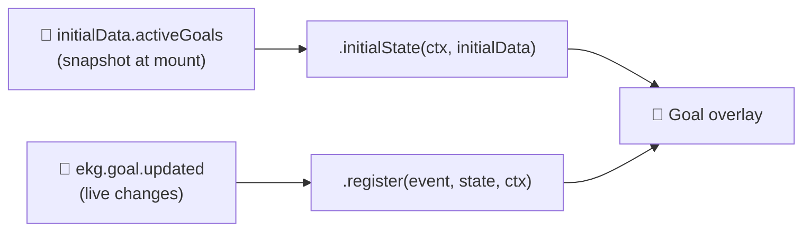

# Building goal widgets

Goals are streamer-configured targets, "200 new followers this stream", "$500
raised for charity", "1,000 total subscribers", that EKG.gg advances
automatically as follows, subscriptions, and tips come in. A goal widget renders
one or more of these goals on stream, usually as a progress bar or counter that
fills up live.

Goal widgets are ordinary overlay widgets, but they pull from two data sources
that most overlays ignore: the `ekg.goal.updated` event and the `activeGoals`
array on `initialData`. This article explains how goals are modeled, how to wire
those two sources together, how to let streamers pick which goals to show, and
the gotchas that bite people writing their first goal widget.

## How a goal widget gets its data

Most overlay widgets only react to events as they happen. A goal already has a
value the moment your widget mounts — it may have been progressing for the whole
stream before your scene became visible — so you need both a starting snapshot
and a stream of updates.



- **`initialData.activeGoals`** — an array of the channel's currently active
  goals, available in `.initialState()`. Each entry has the exact same shape as
  the `data` field of an `ekg.goal.updated` event, so you can write one function
  that handles both.
- **`ekg.goal.updated`** — fired every time a goal changes: created, edited,
  archived, unarchived, reset, and (most often) progressed. Treat each event as
  the latest snapshot of that goal, not a one-time occurrence.

See the [list of events](./list-of-events.md#goal-events) for the full payload
of `ekg.goal.updated`.

### The goal payload

Both sources hand you the same object:

```ts
type Goal = {
  id: string; // unique goal id — match events to snapshot entries with this
  type:
    | "new_followers"
    | "total_followers"
    | "new_subscribers"
    | "total_subscribers"
    | "new_subscriber_points"
    | "total_subscriber_points"
    | "monetary";
  name: string; // streamer-chosen label
  status: "active" | "archived";
  start: number; // value the goal began counting from
  current: number; // current progress
  target: number; // value that marks the goal complete
  currency: string | null; // ISO code for "monetary" goals; null otherwise
};
```

The `new_*` types count only what happens during the current stream, while the
`total_*` types track the channel's cumulative count. For rendering a progress
bar the distinction doesn't matter — `start`, `current`, and `target` already
describe the bar — but it's worth knowing why a `total_followers` goal might
mount with a large non-zero `current`.

## Letting streamers pick which goals to show

A channel can have many goals. Use the `goal_ids` setting type to let the
streamer choose which one(s) this widget should display.

```json
{
  "$schema": "https://ekg.gg/schemas/manifest.json",
  "name": "Goal Bar",
  "version": "1.0.0",
  "description": "A progress bar for a single streamer goal",
  "template": "template.hbs",
  "css": "styles.css",
  "js": "script.ts",
  "settings": {
    "goals": {
      "type": "goal_ids",
      "name": "Tracked Goal",
      "description": "Choose which goal this widget displays",
      "max": 1
    }
  }
}
```

At runtime `ctx.settings.goals` is a `string[]` of goal IDs. Use `max` to cap
how many goals a streamer can select — set it to `1` for a single-goal bar, or
omit it for a widget that renders a list of goals. See
[List of setting types](../settings/list-of-types.md#goal-ids) for details.

> [!NOTE]  
> The selected IDs are just strings. It's up to your widget to match them
> against the goals it receives and ignore everything else.

## Building a single-goal progress bar

### Bootstrap from the snapshot

In `.initialState()`, find the selected goal inside `initialData.activeGoals`.
If it isn't there yet (the array can be empty, or the goal may be brand new),
fall back to an empty state and let the first event fill it in.

```ts
// script.ts
type State = {
  goalId: string | null;
  name: string;
  current: number;
  target: number;
  currency: string | null;
  percent: number; // clamped 0–100 for the bar
  done: boolean;
};

const EMPTY: State = {
  goalId: null,
  name: "",
  current: 0,
  target: 0,
  currency: null,
  percent: 0,
  done: false,
};

function toState(goal: EKG.GoalUpdated["data"]): State {
  // current can exceed target, and target could be 0 mid-edit — clamp here so
  // the template can just use the value.
  const percent =
    goal.target > 0 ? Math.min(100, (goal.current / goal.target) * 100) : 0;

  return {
    goalId: goal.id,
    name: goal.name,
    current: goal.current,
    target: goal.target,
    currency: goal.currency,
    percent,
    done: goal.current >= goal.target,
  };
}

EKG.widget("GoalBar")
  .initialState<State>((ctx, initialData) => {
    const selected = ctx.settings.goals[0];
    const goal = initialData.activeGoals.find((g) => g.id === selected);

    return goal ? toState(goal) : { ...EMPTY, goalId: selected ?? null };
  })
  .register((event, state, ctx) => {
    if (event.type !== "ekg.goal.updated") return state;

    // Only react to the goal this widget is configured to show.
    if (event.data.id !== ctx.settings.goals[0]) return state;

    // An archived goal means the streamer retired it — clear the bar.
    if (event.data.status !== "active") return EMPTY;

    return toState(event.data);
  });
```

### Render the bar

The state already carries a clamped `percent`, so the template just sets the
bar width. Use [`formatCurrency`][helpers] for monetary goals — it understands
minor units (`500` → `$5`) — and [`formatNumber`][helpers] for plain counts.

```hbs
{{#if name}}
  <div class="goal">
    <div class="header">
      <span class="name">{{name}}</span>
      <span class="value">
        {{#if currency}}
          {{formatCurrency current currency}} / {{formatCurrency target currency}}
        {{else}}
          {{formatNumber current}} / {{formatNumber target}}
        {{/if}}
      </span>
    </div>
    <div class="track">
      <div
        class="fill {{#if done}}complete{{/if}}"
        style="width: {{percent}}%"
      ></div>
    </div>
  </div>
{{/if}}
```

There are no arithmetic helpers in templates, so do progress math (like the
`percent` above) in your script and pass the result through state. See the
[list of view helpers][helpers] for everything available to templates.

## Gotchas

Goals behave a little differently from the other events you may have worked
with. These are the things worth getting right up front.

### Goals never auto-complete

Reaching `target` does **not** archive a goal or change its `status`. A goal
stays `active` with `current >= target` until the streamer manually archives it.
If you want a "Goal reached!" state, compute it yourself (`current >= target`)
rather than waiting for a status change that won't come. And because `current`
can keep climbing past `target`, always clamp your progress bar to 100%.

### Archived goals fire one last event, then disappear

When a streamer archives (or otherwise retires) a goal, you receive one final
`ekg.goal.updated` event for it with `status: "archived"` — your chance to
animate it out or show a celebration. After that, the goal is removed from
`initialData.activeGoals`, so a widget that mounts later won't see it at all.
Handle the non-`active` status explicitly; don't assume every event you get is
for a live goal.

### You'll get many events for the same goal

A progressing goal emits an event on every increment. Match events to goals by
`id` and treat each event as the current snapshot — overwrite, don't accumulate.
If you're tracking several goals at once, key your state by `id` and upsert:

```ts
.register((event, state, ctx) => {
  if (event.type !== "ekg.goal.updated") return state;

  const goal = event.data;
  if (!ctx.settings.goals.includes(goal.id)) return state;

  const goals = { ...state.goals };
  if (goal.status === "active") {
    goals[goal.id] = goal; // upsert the latest snapshot
  } else {
    delete goals[goal.id]; // retired — drop it
  }
  return { ...state, goals };
});
```

### Monetary goals are in minor units

For `monetary` goals, `start`, `current`, and `target` are in the **minor
units** of `currency` — cents for `USD`, pence for `GBP`, and so on — and
`currency` is a non-null ISO code. Every other goal type reports plain counts
with `currency: null`. Format monetary values with the
[`formatCurrency`][helpers] helper rather than printing the raw integer, or
`2500` will show up where you meant `$25.00`.

Tips made in a different currency than the goal are converted into the goal's
currency before being added to `current`, so you never have to do conversion in
the widget — just format `current` using `currency`.

### Goal events come from EKG, not a platform

Unlike chat or follows, goals are an EKG.gg construct. On every
`ekg.goal.updated` event `platform` is always `"ekg"` and `raw` is always an
empty object, so there's nothing platform-specific to read out of `raw`.

## Further reading

- [List of EKG events](./list-of-events.md#goal-events)
- [List of setting types](../settings/list-of-types.md#goal-ids)
- [`.register()` best practices](./best-practices.md)
- [Using the ctx object][ctx]
- [Dealing with time](./dealing-with-time.md)
- [List of EKG.gg view helpers][helpers]

[ctx]: ./the-ctx-object.md
[helpers]: ../templating/list-of-helpers.md
