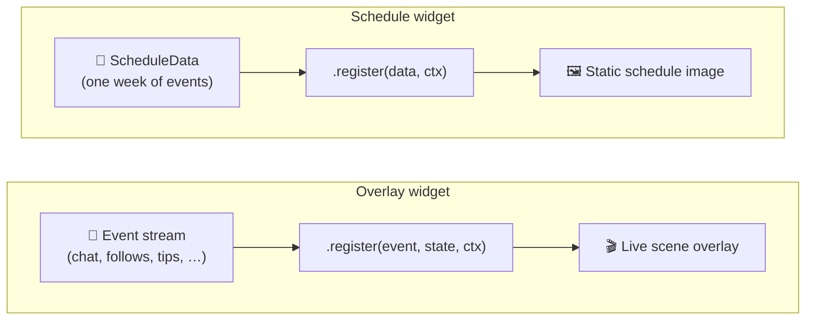

# Building schedule widgets

Most widgets on EKG.gg are overlay widgets: they live on a scene, react to
events as they happen, and update in real time. Schedule widgets are different.
Instead of rendering a live overlay, they render a channel's upcoming weekly
schedule as a static image that can be shared as an embed or social preview.

This article explains how schedule widgets differ from overlay widgets, how to
mark a manifest as being for a schedule widget, the `EKG.schedule()` API, and
how to build one with the devkit.

## How schedule widgets differ from overlay widgets

Overlay widgets are event-driven. They receive a stream of events
(`ekg.chat.sent`, `ekg.channel.followed`, `ekg.tip.sent`, and so on), update
their state in response, and re-render every time the state changes. They run
for as long as the scene containing them is visible.

Schedule widgets are data-driven. They receive a single `ScheduleData` object
describing a week's worth of calendar events, render once, and produce an
image. They don't see events, they don't tick, and they don't maintain state
across time.



At a glance:

| | Overlay widget | Schedule widget |
| --- | --- | --- |
| Input | `EKG.Event` stream | `EKG.ScheduleData` (once) |
| Registration | `EKG.widget(name)` | `EKG.schedule(name)` |
| Callback | `(event, state, ctx)` | `(data, ctx)` |
| TICK events | Yes | No |
| Persisted state | Yes | No |
| Output | Live scene overlay | Static image (OG image / embed) |
| Typical use | On-stream alerts, counters, chat | Shareable weekly schedule |

## Marking a manifest as a schedule widget

A widget tells EKG.gg what kind it is through the `type` field in its
`manifest.json`. Omit the field and you get an overlay widget; set it to
`"schedule"` and you get a schedule widget.

```json
{
  "$schema": "https://ekg.gg/schemas/manifest.json",
  "type": "schedule",
  "name": "Weekly Schedule",
  "version": "1.0.0",
  "description": "A weekly stream schedule widget",
  "template": "template.hbs",
  "css": "styles.css",
  "js": "script.ts",
  "settings": {
    "title": {
      "type": "string",
      "default": "This Week"
    }
  }
}
```

> [!NOTE]  
> The `type` field is what the devkit and EKG.gg use to pick the right runtime
> behavior. If you forget it, your widget will be treated as an overlay and
> the `EKG.schedule()` registration will never receive any data.

## The `EKG.schedule()` interface

Where overlay widgets use `EKG.widget()`, schedule widgets use
`EKG.schedule()`. The API is deliberately smaller because a schedule widget
has much less to do:

```ts
EKG.schedule(name: string): {
  register(fn: (data: EKG.ScheduleData, ctx: EKG.WidgetContext) => unknown): void
}
```

There's no `.initialState()`, `.persist()`, or `.restore()`. There are no
events to handle. Your callback receives the full week of schedule data and
returns the state that will be handed to your template.

The simplest possible schedule widget just passes the data straight through:

```ts
// script.ts
EKG.schedule("Weekly Schedule").register((data, ctx) => {
  return data;
});
```

### The `ScheduleData` shape

`EKG.ScheduleData` always contains exactly seven days, in order, starting from
the week's first day:

```ts
type ScheduleData = {
  days: Array<{
    date: { year: number; month: number; day: number };
    dayOfWeek: "mon" | "tue" | "wed" | "thu" | "fri" | "sat" | "sun";
    events: Array<{
      time: number;            // Unix timestamp in milliseconds
      title: string;
      subtitle: string | null;
    }>;
  }>;
};
```

A few things worth knowing:

- `time` is a millisecond Unix timestamp, not a `Date`. See
  [Dealing with time](./dealing-with-time.md) for why the VM has no `Date`
  global and how to format timestamps using template helpers.
- `events` may be empty for days with nothing scheduled. Your template should
  handle that case gracefully.
- Days are always present, even if empty. You can render a seven-column grid
  without worrying about missing entries.

### The `ctx` object

The context passed to your `.register()` callback is the same context overlay
widgets receive — `settings`, `assets`, `now`, `size`, and `random()`. See
[Using the ctx object][ctx] for the full breakdown.

> [!NOTE]  
> Schedule widgets don't receive TICK events, so `ctx.now` reflects the time
> the image was rendered. Don't build animations that assume a running clock.

## Building one with the devkit

The devkit supports schedule widgets out of the box. Scaffolding, hot reload,
and building all work the same way they do for overlay widgets — the only
thing that changes is how you preview your widget and the API you write
against.

### Scaffold a project

```
npm create ekg@latest my-schedule
cd my-schedule
```

Open `manifest.json` and set the `type` field:

```json
{
  "type": "schedule",
  ...
}
```

### Write the handler

In `script.ts`, register your widget with `EKG.schedule()` and return the
state your template needs:

```ts
// script.ts
EKG.schedule("Weekly Schedule").register((data, ctx) => {
  return {
    title: ctx.settings.title,
    days: data.days,
  };
});
```

### Render the schedule

Your template is a normal Handlebars template, but instead of rendering state
that changes over time, you iterate over the week:

```hbs
<div class="schedule">
  <h1>{{ title }}</h1>
  <div class="grid">
    {{#each days}}
      <div class="day">
        <div class="day-header">
          <span class="day-name">{{dayOfWeek date "long"}}</span>
          <span class="day-date">{{formatDate date "medium"}}</span>
        </div>
        {{#each events}}
          <div class="event">
            <span class="time">{{formatTime time}}</span>
            <span class="title">{{ title }}</span>
            {{#if subtitle}}<span class="subtitle">{{ subtitle }}</span>{{/if}}
          </div>
        {{/each}}
      </div>
    {{/each}}
  </div>
</div>
```

Helpers like `formatDate`, `formatTime`, and `dayOfWeek` are available to all
widgets. See [List of EKG.gg view helpers](../templating/list-of-helpers.md)
for the full list.

### Preview with `ekg dev`

```
npm run dev
```

The devkit's dev server detects `"type": "schedule"` and switches the preview
UI accordingly. Instead of the event buttons you'd see for an overlay widget,
the right-hand panel is a **schedule editor** where you can:

- Pick which week is being previewed
- Add, edit, and remove individual calendar events
- Generate a set of sample events with one click
- Adjust the canvas dimensions and background color

Every time you edit the schedule in the panel, the devkit re-invokes your
`.register()` callback with the updated `ScheduleData`, so you get the same
live-reload experience as an overlay widget.

> [!TIP]  
> Design your template to fill that canvas edge to edge and test a few
> different amounts of events per day — empty days, full days, and days with a
> single event all look different.

### Build for upload

When you're happy with it:

```
npm run build
```

The build command validates your manifest, compiles your TypeScript, and
produces a `dist/` folder containing everything EKG.gg needs. From there,
upload the built widget through the artist portal the same way you would an
overlay widget.

## Further reading

- [Using the ctx object][ctx]
- [Using TypeScript](./using-typescript.md)
- [Dealing with time](./dealing-with-time.md)
- [List of EKG.gg view helpers](../templating/list-of-helpers.md)

[ctx]: ./the-ctx-object.md
